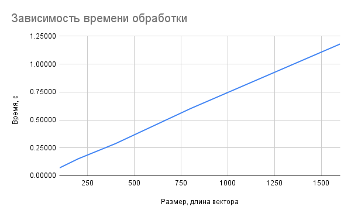

# Гибридные вычисления
Худоярова Анастасия, группа М21-522, вариант 12

## Бизнес - логика 
Поворот в N-мерном пространстве M-точек (M-векторов столбцов умножаются на M одинаковых матриц поворота размера NxN)

## Генератор 
Запуск генератора с помощью команды `./generator.bin N_size N_Mb`, где N_size - размерность пространства, N_mb - размер файла в мегабайтах, где файл по сути будет содержать некоторое количество M - векторов - столбцов, отражающих расположение точек в пространстве. <br/>
Генератор создает vectors, который является матрицей M. И создает matrix, заполняя нормированными значениями от 0 до 1 (```(float)rand() / (float)RAND_MAX;```), так как это матрица со значениями синусов и косинусов углов.<br/>
По итогу результирующие матрицы сохраняются в бинарные файлики matrix.txt и vector.txt

## Описание алгоритма бизнес - логики 
1. пересчитываются размеры данных, то есть исходя из количества мегабайт определяется сколько надо сгенерировать точек. 
2. считываются матрицы из файлов в память
2. задаётся результирующий вектор, который будет отражать результат перемножения матрицы поворота на вектора
3. в функцию `process` передается размерность вектора, число точек, значения векторов и матрицы поворота, результирующая матрица 
4. столбец матрицы векторов умножается построчно на матрицу поворота. По итогу формируется вектор размерности N, который записывается в нужный столбец
5. результат записывается в файл

Вычислительная логика в файле `main.c` (запуск `./main.bin N_size N_Mb vector_file.txt matrix_file.txt`)

## Графики
Время последовательной версии программы для размерности вектора 10 (то есть 10-ти мерное пространство), и объёма точек для поворота 100, 200,400,800,1600 Мб
